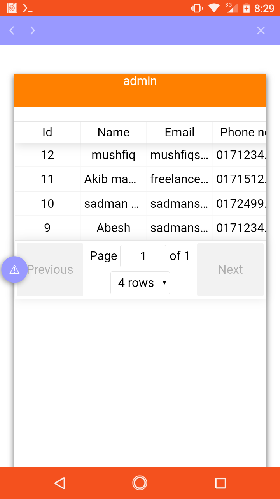
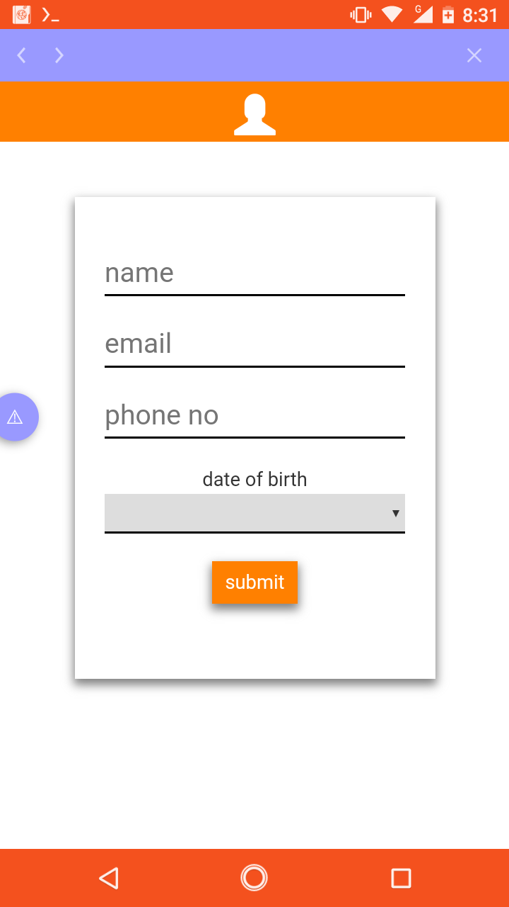
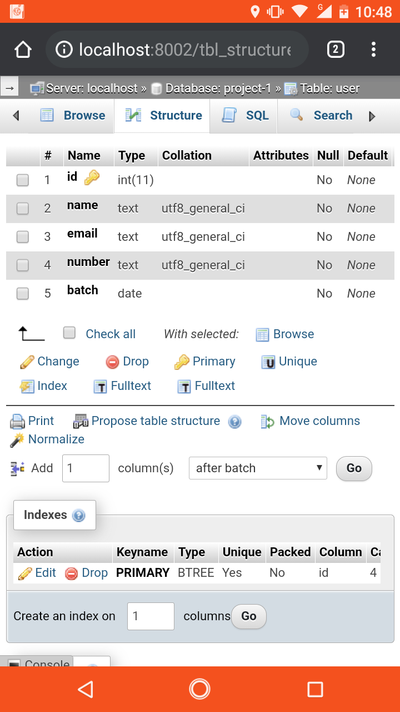

<h1>setup</h1>

this form is made with react js and nodejs. The frontend part is made with cdn links so locally 
react js is not needed to be installed. For backend node js is needed to be installed. I used Acode code editor. follow  all the steps bellow

<h2>admin</h2>

<h2>client</h2>


<h2>installation and running</h2>


run these commands in your terminal
<h3>step-1</h3>
clone this project and inter the api folder.

```bash
$ git clone https://github.com/sadman-sakib-abesh/registration_client_admin.git && cd registration_client_admin
```
<h3>step-2</h3>
install nodemailer, body-parser, express and cors.


```bash
$ npm install express
$ npm install cors
$ npm install nodemailer
$ npm install body-parser
$ npm install mysql
```

<h3>step-3</h3>

in your local mysql server login to root and creat a database named project-1 and then creat a table named user and add 5 rows like this:<br />



<h3>step-4</h3>

now edit the file api/index.js on line 50,51 and 60 set your mail address and password. after that inter this link https://www.google.com/settings/security/lesssecureapps and allow less secured apps. Dont't skip this step. If you don't set it, the application will not send mail and form data will not be addd to database.

```javascript
var transporter = nodemailer.createTransport({
  service: 'gmail',
  auth: {
    user: 'yourmail@gmail.com',
    pass: 'password'
  }
});


   //mailing user interface
var mailOptions = {
  from: 'yourmail@gmail.com',//
  to:req.body.email,                
  subject: 'Registration confirmed',//
  text: 'This is a dummy mail sent from server'//
};
```

<h3>step-5</h3>

now run backend server from terminal


```bash
$ node index.js
```

if the server runs successfully then you will get a massage

```bash
$ node index.js
$ successful 
$ connected
```

if you don't get connected massage it mean's database is not configured as step-3
 now browse client/index.html to send data via form and browse admin/index.html to see database.
